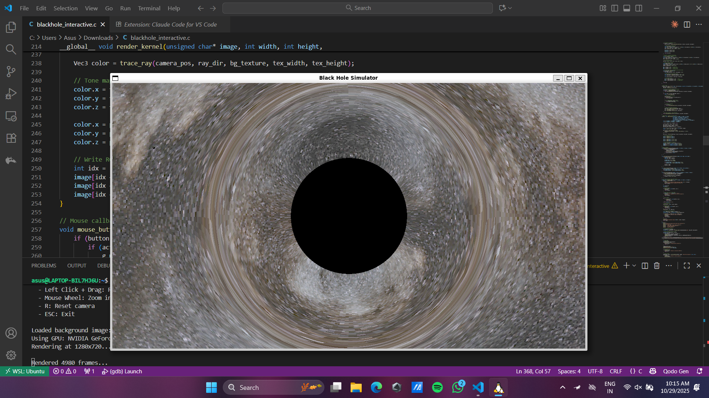

# Schwarzschild Black Hole Simulator

An interactive real-time black hole ray tracer using CUDA and OpenGL, featuring:

- **GPU-accelerated ray tracing** with CUDA
- **Gravitational lensing** effects (Schwarzschild metric)
- **Interactive controls** (mouse rotation, zoom)
- **Spacetime curvature visualization** with curved grid
- **Accretion disk effects**



## Requirements

- NVIDIA GPU with CUDA support
- Ubuntu Linux (or WSL2)
- CUDA Toolkit
- OpenGL libraries (GLFW, GLEW)

## Installation
```bash
# Install dependencies
sudo apt update
sudo apt install build-essential nvidia-cuda-toolkit
sudo apt install libglfw3-dev libglew-dev libglu1-mesa-dev

# Compile
nvcc -o blackhole_interactive blackhole_interactive.cu \
  -lglfw -lGL -lGLEW -lGLU -O3

# Run
./blackhole_interactive
```

## Controls

- **Left Click + Drag**: Rotate camera around black hole
- **Mouse Wheel**: Zoom in/out
- **R**: Reset camera to default position
- **ESC**: Exit

## Physics

This simulator implements:
- Schwarzschild metric for non-rotating black holes
- Geodesic ray tracing through curved spacetime
- Event horizon at the Schwarzschild radius
- Gravitational light bending (Einstein ring effect)

## License

